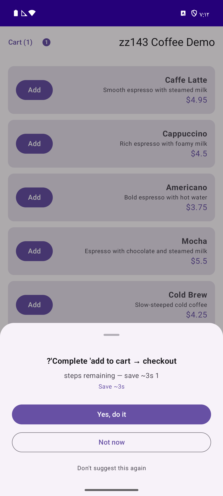
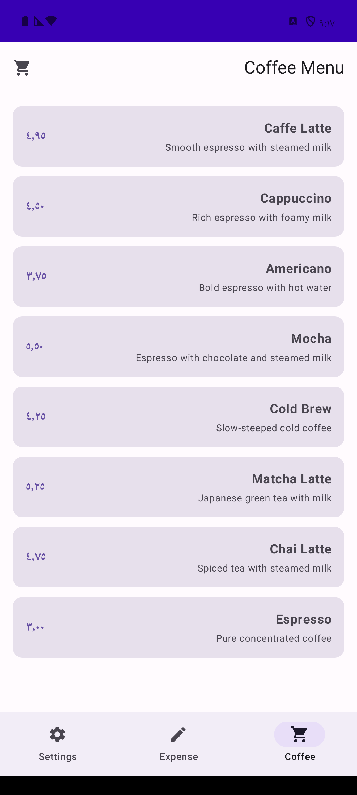
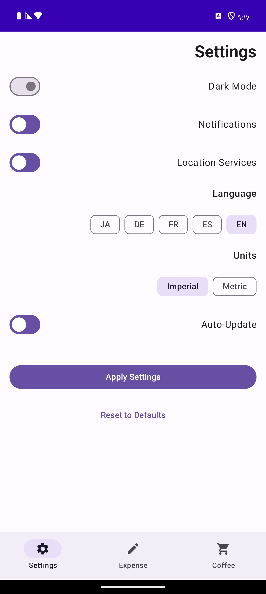

<p align="center">
  <h1 align="center">zz143</h1>
  <p align="center">
    <strong>Session replay that replays back.</strong>
    <br />
    An experimental Android SDK that watches how users interact with your app, learns their patterns, and offers to automate repetitive workflows.
  </p>
</p>

<p align="center">
  <a href="#"></a>
  <a href="#"></a>
  <a href="#"></a>
  <a href="LICENSE"></a>
</p>

<p align="center">
  
  
  
</p>

> **Alpha software.** This is an early prototype exploring whether in-app workflow learning is useful. The API will change. Not production-ready. We're looking for feedback, not production users.

---

## The idea

20+ SDKs can record what users do in your app (FullStory, PostHog, UXCam). They replay sessions on web dashboards for analytics.

**What if the replay happened inside the app, for the user?**

zz143 observes user actions, detects recurring patterns using n-gram sequence analysis, and offers to automate them via a suggestion bottom sheet. When the user confirms, it calls your annotated handler methods directly.

### Who this is for

zz143 is useful for apps where **users repeat multi-step workflows with consistent parameters**:

- **Finance/expense apps** — "Coffee ₹250, Food category" entered every morning
- **Food ordering** — same customized order every week
- **E-commerce** — repeat purchases with same shipping/payment
- **Enterprise data entry** — same form fields filled 50x/day
- **Booking apps** — same route, same preferences, same payment method

### Who this is NOT for

If your app has one-shot flows (file converters, generators), server-side automation (CRM campaigns), or simple preferences (theme/language toggles that SharedPreferences handles in 5 lines) — you don't need this SDK.

```
A user orders a latte with the same customizations 3 times:
  1. Customize: Large, Oat Milk, Extra Shot
  2. Add to cart
  3. Apply promo "SAVE10"
  4. Select Pickup
  5. Confirm order

On the 4th visit, zz143 suggests:
  "Large, Oat, Extra Shot, SAVE10, Pickup?"
  [Yes, do it] [Not now] [Don't suggest again]
```

## How it works

```
OBSERVE              LEARN                SUGGEST             EXECUTE
  |                    |                    |                    |
  v                    v                    v                    v
Developer calls      N-gram frequency     Bottom sheet        Calls your
ZZ143.trackAction()  analysis detects     appears when        @WatchAction
for each user        recurring            user begins a       methods with
action               sequences            known sequence      learned params
```

**Important:** zz143 does NOT auto-capture UI interactions. You must explicitly call `ZZ143.trackAction()` at each step you want tracked. This is a deliberate design choice for reliability and privacy.

## Quick start

> zz143 is not published to Maven Central yet. To try it, clone this repo and use the demo app, or add the modules as local project dependencies.

### 1. Clone and build

```bash
git clone https://github.com/jeremiahddavid/zz143.git
cd zz143
./gradlew assembleDebug
```

### 2. Initialize in your Application

```kotlin
class MyApp : Application() {
    override fun onCreate() {
        super.onCreate()
        ZZ143.init(this) {
            suggestionsEnabled(true)
            minPatternOccurrences(3)
            debugLogging(true)
        }
        ZZ143.startCapturing()
    }
}
```

### 3. Track actions explicitly

```kotlin
// You must call trackAction() at each step
fun onAddToCart(product: Product) {
    cartService.add(product)
    ZZ143.trackAction("add_to_cart", mapOf("productId" to product.id))
}

fun onCheckout(method: String) {
    orderService.checkout(method)
    ZZ143.trackAction("checkout", mapOf("deliveryMethod" to method))
}
```

### 4. Register replay handlers

```kotlin
class OrderActions {
    @WatchAction(type = "add_to_cart")
    fun addToCart(
        @WatchParam(name = "productId") productId: String,
        @WatchParam(name = "quantity") quantity: Int = 1
    ): Boolean {
        return cartService.add(productId, quantity)
    }

    @WatchAction(type = "checkout")
    fun checkout(
        @WatchParam(name = "deliveryMethod") delivery: String
    ): Boolean {
        return orderService.checkout(delivery)
    }
}

// In your Activity
ZZ143.registerActions(orderActions)
```

### 5. Show the suggestion UI

```kotlin
// In your Composable
val suggestion by ZZ143.activeSuggestion.collectAsState()

ZZ143SuggestionSheet(
    suggestion = suggestion,
    onAccept = { ZZ143.acceptSuggestion(it.suggestionId) },
    onDismiss = { ZZ143.dismissSuggestion(it.suggestionId) },
    onReject = { ZZ143.rejectSuggestion(it.suggestionId) }
)
```

## Demo app

The repo includes a demo app with 3 scenarios:

| Tab | Scenario | What it demonstrates |
|-----|----------|---------------------|
| **Coffee Shop** | Drink customization + ordering flow | Multi-step workflow with parameter learning (size, milk, extras) |
| **Expense Report** | Form with fixed vs variable fields | Learns that Category=Travel and Project=Alpha are always the same |
| **Settings** | Toggle preferences + apply | Single-action workflow with many parameters |

To run the demo: `./gradlew :demo-app:installDebug`

## Architecture

```
+-----------------------------------------------+
|                YOUR APP                         |
|                                                 |
|  ZZ143.trackAction("add_to_cart", params)      |
|  @WatchAction fun addToCart(...)               |
|                                                 |
+------------------+----------------------------+
                   |
          +--------v--------+
          |   zz143 SDK     |
          |                 |
          | [Capture]       |  Gesture + navigation tracking
          | [Learn]         |  N-gram patterns + temporal detection
          | [Suggest]       |  Throttled suggestion UI (Compose)
          | [Replay]        |  Direct invocation via reflection
          |                 |
          | [Event Bus]     |  SharedFlow, binary TLV encoding
          | [File Queue]    |  Crash-safe segment files + CRC32
          | [SQLite]        |  Workflow persistence + pattern storage
          +-----------------+
```

### Modules

| Module | Description |
|--------|-------------|
| `zz143-core` | Data models, event bus, storage engine, orchestration, configuration |
| `zz143-capture` | View tree walker, gesture interceptor, delta computation |
| `zz143-learn` | N-gram extraction, Smith-Waterman alignment, temporal detection, confidence scoring |
| `zz143-suggest` | Suggestion engine, throttling, user preference tracking, Compose bottom sheet |
| `zz143-replay` | `@WatchAction` annotations, action registry, state machine, replay strategies |
| `zz143-android` | Activity lifecycle hooks, Compose extensions, App Startup initializer |

## What works today

- Pattern detection via n-gram frequency analysis on tracked actions
- Parameter-aware learning (identifies which params are fixed vs variable across repetitions)
- Suggestion bottom sheet (Material 3 Compose) with accept/dismiss/reject
- Workflow replay via `@WatchAction` method invocation with name-based parameter mapping
- Workflow persistence across app restarts (SQLite)
- Time-based proactive suggestions (detects daily/weekly patterns)
- Suggestion throttling with exponential backoff on dismissal
- Binary TLV event encoding (3-5x smaller than JSON)
- Crash-safe file queue with CRC32 checksums
- 153 unit tests across 10 test classes

## Known limitations

This is alpha software. Be aware of:

- **Manual tracking required.** You must call `ZZ143.trackAction()` at every step. There is no automatic UI interaction capture.
- **Not published to Maven.** Must be used as local project dependency or built from source.
- **Minimally tested.** Verified on one emulator (API 36). No production testing. No performance benchmarks.
- **Kotlin/Java only.** No Flutter, React Native, or Xamarin support yet. The core SDK is Kotlin — cross-framework wrappers are on the roadmap but depend on community demand.
- **No iOS SDK.** Android only for now.
- **No cross-device sync.** Patterns are learned per-device only.
- **No PM dashboard.** No analytics or insights for product teams.
- **Reflection-based replay.** `findHandler()` uses Java reflection which may be fragile with ProGuard in release builds (consumer rules are included but not battle-tested).
- **In-memory pattern detection.** The n-gram analysis runs on in-memory action history. Long-running apps with thousands of actions may need tuning.
- **No integration tests.** Unit tests cover individual components but the full end-to-end pipeline is not automatically tested.
- **Suggestion UX is basic.** The bottom sheet works but hasn't been tested with real users for annoyance/usefulness balance.

## Privacy

zz143 is on-device by design:

- **No screenshots.** Capture uses view tree wireframes, never pixel data.
- **Text masked by default.** `captureTextValues = false` stores only hashed values.
- **Password fields auto-redacted.** Secure input types are never captured.
- **No network calls.** Nothing leaves the device. No cloud, no analytics server, no telemetry.
- **User control.** Users can dismiss, snooze, or permanently reject any suggestion.

## Roadmap

- [x] Core pipeline: capture, learn, suggest, replay
- [x] Parameter-aware workflow learning
- [x] Workflow persistence (SQLite)
- [x] Time-based proactive suggestions
- [x] Demo app with 3 scenarios
- [x] Unit tests (153 tests)
- [ ] Publish to Maven Central
- [ ] Integration tests (end-to-end pipeline)
- [ ] Performance benchmarks
- [ ] Compose semantics tree auto-capture
- [ ] iOS SDK (Swift)
- [ ] React Native / Flutter wrappers
- [ ] Developer dashboard (pattern analytics)
- [ ] AppFunctions bridge (use `@AppFunction` methods as execution targets)

## Contributing

We welcome contributions, especially:
- Bug reports from trying to integrate in your app
- Feedback on the API design
- Performance testing on different devices
- Ideas for use cases we haven't considered

See [CONTRIBUTING.md](CONTRIBUTING.md) for guidelines.

## License

Apache 2.0. See [LICENSE](LICENSE).
